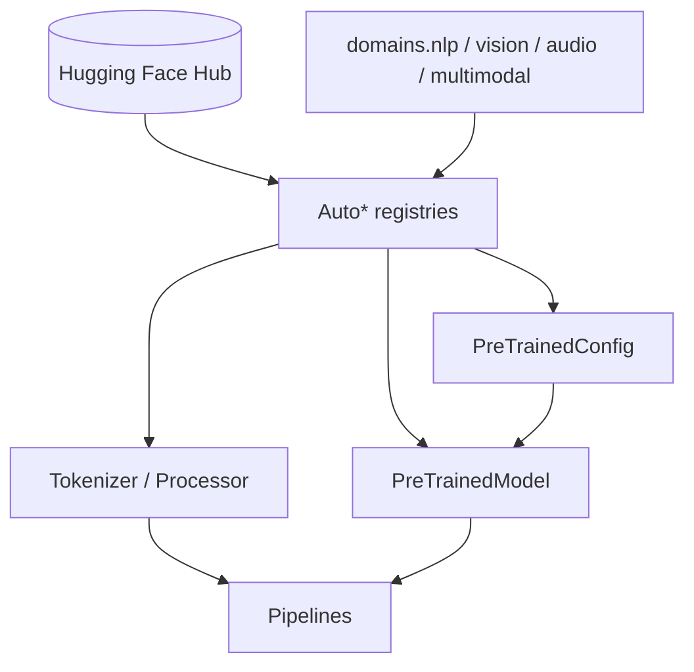

# Developer onboarding (Forge modernization)

Welcome to the Hugging Face **Transformers** modernization track. This guide is the
starting point for contributors working on architecture, CI guardrails, and model code.

## Repository structure

| Area | Path | Role |
|------|------|------|
| Public API | `src/transformers/__init__.py` | Lazy exports via `_LazyModule` |
| Domains | `src/transformers/domains/` | NLP / vision / audio / multimodal registries |
| Models | `src/transformers/models/<name>/` | Config, modeling, modular, tokenizers |
| Protocols | `src/transformers/protocols.py` | Config–model boundary contracts |
| CI baselines | `.ci/` | Import graph, layer violations, import time |

## Modular file system

New models should be authored in `modular_<model>.py`. Generated files
(`modeling_*.py`, etc.) are produced by:

```bash
python utils/modular_model_converter.py path/to/modular_<model>.py
make check-modular-conversion
```

See [ADR 004](../../architecture/adr/004-modular-file-code-generation.md).

## Auto* registry

`AutoModel`, `AutoConfig`, and related classes map `model_type` strings to classes via
`CONFIG_MAPPING` / `MODEL_MAPPING`. See [ADR 005](../../architecture/adr/005-auto-class-registry-pattern.md).

## Layer conventions

- **Config** (`configuration_*.py`): hyperparameters only; no modeling imports.
- **Model** (`modeling_*.py` or generated): weights and forward logic.
- **Utils**: shared helpers; avoid config→model imports.

Details: [config_model_protocols.md](../../architecture/config_model_protocols.md),
[layer_violation_remediation.md](../../architecture/layer_violation_remediation.md).

## Architecture map



## CI workflow (local)

```bash
make check-import-linter
make check-layer-violations
make check-modular-conversion
make check-downstream-compat
make test-domain-registries
```

## Your first contribution

1. Pick a small issue (docs, test, or single-file fix).
2. Read the relevant [ADR](../../architecture/adr/README.md).
3. Run `make fix-repo` before opening a PR.
4. Ensure no new import cycles or layer violations.

## Related ADRs

- [001 — Init decomposition](../../architecture/adr/001-init-decomposition.md)
- [002 — DeviceContext](../../architecture/adr/002-device-context.md)
- [003 — LazyModule](../../architecture/adr/003-lazy-module-import-pattern.md)
- [004 — Modular codegen](../../architecture/adr/004-modular-file-code-generation.md)
- [005 — Auto* registries](../../architecture/adr/005-auto-class-registry-pattern.md)
- [006 — Safetensors](../../architecture/adr/006-safetensors-over-pickle.md)
- [007 — trust_remote_code](../../architecture/adr/007-trust-remote-code-gate.md)
